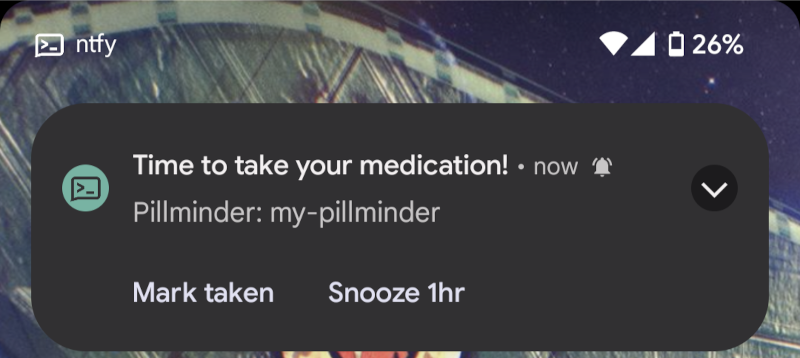
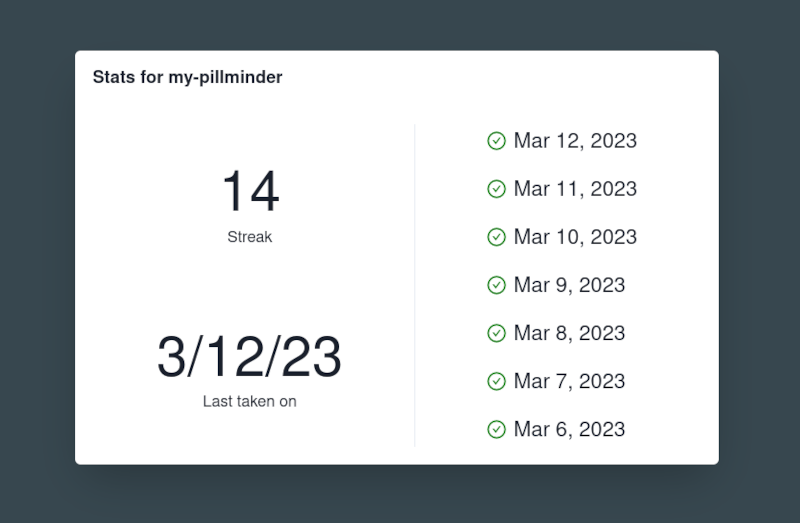

# Pillminder

Pillminder is an application designed to remind you to take your daily
medication. It uses [ntfy.sh](https://ntfy.sh/) to push reminders to your phone
at preconfigured times, until you mark it as taken.

## Motivation

I am somewhat notorious with my doctors for missing doses of my medication.
While I've tried every medication reminder method under the sun, the one thing
I noticed was it was too easy for me to say "I'll take them after I finish
this" and then forget.

Pillminder is designed to be "annoying", reminding you to take your medication
until you tell it you have taken it. Of course, you can also snooze these
reminders if you are out and about and won't be able to take it. Pillminder
also keeps track of when you take your medication, and allows you to view how
compliant you have been.

While the application is self-hosted, it also supports multiple
users/reminders, allowing you share it with your family and friends 😊.

## Screenshots





## Setup

Pillminder's docker container expects two directories: a data directory, and a
configuration directory.

Pillminder stores persistent data in an SQLite database, and requires one to be
created before you begin. The simplest way to do this is to just create a 0
byte file named `pillminder.db` in your data directory.

Pillminder also requires a configuration to specify your timers
("pillminders"). This should be called `config.exs` and placed in your config
directory. An example configuration follows

```elixir
config :pillminder,
  timers: [
    [
      # The name of your timer/pillminder
      id: "my-pillminder",
      # How often you will be reminded, expressed in seconds
      reminder_spacing: 5 * 60,
      # The time that you will start being reminded, expressed in the timezone
      # in which this application runs.
      reminder_start_time: ~T[09:30:00],
      # The time zone in which timezones should be used. This can be either
      # :local or a standard timezone string (Timex recognizes some other
      # formats, as well)
      reminder_time_zone: "America/New_York",
      # The topic on which ntfy.sh will remind you. This is technically public,
      # [so pick something sufficiently random.
      ntfy_topic: "REPLACE_ME",
      # optional, the API key to use with ntfy. This is not required for
      # ntfy.sh, but is useful if you wish to use their premium features.
      ntfy_api_key: "REPLACE_ME",
      # optional, a "fudge time", expressed seconds. If specified, your #
      # reminders will start at the specified start time, plus a random number of
      # seconds, with an upper bound of the specified fudge time
      reminder_start_fudge_time: 10 * 60
    ]
  ],
  # The base address that all URLs in notifications will be based on
  base_url: "http://your-hostname",
  # optional, HTTP server settings
  server: [
    # The address for the http server to listen on
    listen_addr: "127.0.0.1",
    # The port for the HTTP API server to listen on. Note that this if using
    # the provided Docker setup, this is not the port you will use to access the
    # application; see the below `docker-compose` file for that. By default,
    # nginx in the `web` container points to port 8000 for this server, but this
    # can freely be changed if needed.
    port: 8000
  ]
```

Lastly, you must configure Docker Compose to point to your directory. You
should create a `docker-compose.override.yml` in the root of this project as
follows.

```yml
services:
  app:
    volumes:
      - /path/to/your/data/directory:/var/lib/pillminder
      - /path/to/your/config/directory:/etc/pillminder
  web:
    ports:
      # Port for the nginx server to listen on; this is where you will access
      # both the Web UI and the REST api.
      - "8080:80"
```

You can start the application with `docker compose up` (if a rebuild is
required, run `docker compose build`)

## Development

This application consists of two parts:

- A backend Elixir server to send the reminders, perform statistics tracking,
  and provide a REST API (located in the `app` directory).
- A small React frontend (located in the `web-client` directory). This builds
  to static HTML/JS files, which can be distributed with any webserver.

### Backend Serer

The development webserver can be run using `mix run --no-halt` in the `app`
directory. If `MIX_ENV` is set to `dev`, then the web-client will be served at
`/app/`, as well.

### Frontend

The frontend can be built with `npm run build:dev`, which will compile to
static html files in the `dist` directory. You can also use `npm start` to
start a watchful webpack instance for instant-rebuild.
